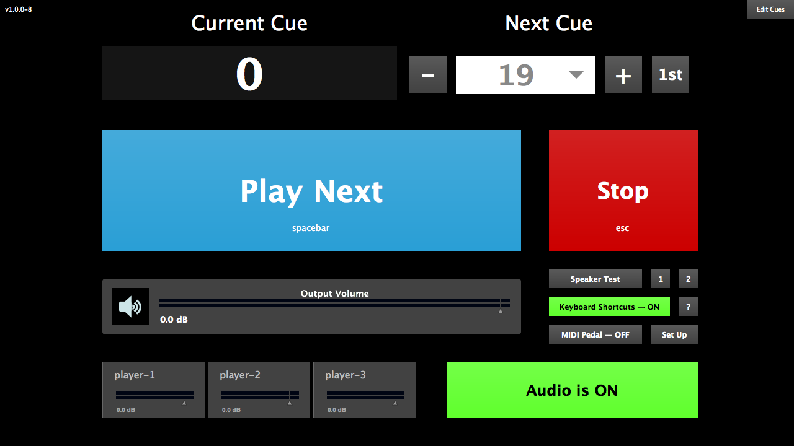

# jam-box 

:violin: Sample playback for Clara Iannotta’s _dead wasps in the jam-jar (iii)_

## Installation

`jam-box` is a package for use with Cycling 74’s [Max](https://cycling74.com/products/max/) software. If you don’t own Max, you can [download it from Cycling 74’s website](https://cycling74.com/downloads/) for free.

To install the `jam-box` package:

1. Download the [__latest version__](https://github.com/delucis/jam-box/releases/latest) (click on `jam-box.zip`).

2. Unzip it to your packages directory:    
`~/Documents/Max/Packages` for Max 6 or `~/Documents/Max 7/Packages` for Max 7.

## Performance Set-up

A performance of _dead wasps in the jam-jar (iii)_ requires the following technical set-up:

- a computer running the `jam-box` Max package
- a stereo pair of loudspeakers within the orchestra for sound output

## Operating the Jam Box

### Getting Started

1. Open **Max**.

2. Select **Jam Box** from the **Extras** menu. This window should appear:

  

3. Turn on the audio, using the large red button that reads **Audio is OFF**. It will turn green and read **Audio is ON**.

4. If you need to test your audio output, you can use the **Speaker Test** button to send out short bursts of white noise. To test just one channel at a time, you can use the buttons marked **1** and **2**.

### Performing with the Jam Box

The Jam Box window indicates the **Current Cue** at the top left, and the **Next Cue** that will be played at the top right. Cues are numbered to match the bar numbers in which they occur, so the first cue number is 32.

During a performance, use the large blue **Play Next** button or the <kbd>spacebar</kbd> to trigger the next cue at the appropriate moment.

By default, keyboard shortcuts are enabled and you can use the following shortcuts to control the Jam Box:

|      shortcut       |                                  |
|:-------------------:|:---------------------------------|
| <kbd>spacebar</kbd> | _play next cue_                  |
|  <kbd>escape</kbd>  | _stop playing_                   |
|    <kbd>1</kbd>     | _set next cue to be first cue_   |
|    <kbd>▶</kbd>     | _increment next cue number_      |
|    <kbd>◀</kbd>     | _decrement next cue number_      |
|    <kbd>▲</kbd>     | _increase output volume by 1 dB_ |
|    <kbd>▼</kbd>     | _decrease output volume by 1 dB_ |

### Rehearsal Tips

- To stop playback at any point during rehearsal, click the red **Stop** button, or hit the <kbd>escape</kbd> key.

- Use the <kbd>◀</kbd> and <kbd>▶</kbd> arrow keys to set up the next cue, or use the <kbd>1</kbd> key to reset the next cue to the beginning. To select a specific cue, you can click on the **Next Cue** number and a menu will appear from which you can choose the cue you need.
